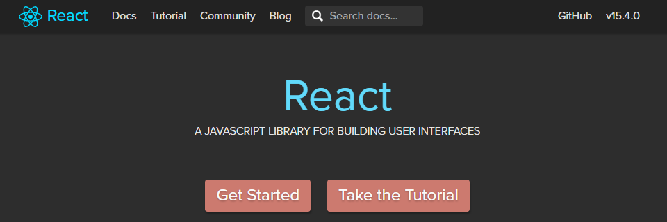
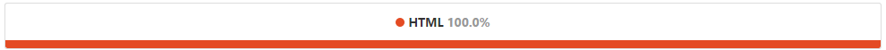

React v15をやってみよう (1) - まずはHTMLだけで
====

まずはHTMLファイルだけで、`React v15`を感じてみよう。
----



- - -

### はじめに

`React v15`を始めたいけど、  
たくさんキーワードやツールが出てきて、環境をそろえろ、とか  
どこから手を付けていいのかわからなくて、いつまでも始められない、  
初心者の方のために、この記事を書いています。

それではエディタ以外になんの武器も持っていない人も、  
順番に装備していきましょう。

とりあえず最初は`Node.js`/`npm`から...  
今のところGrunt/Gulp/Browserify/WebPack/TypeScriptとか、全部無しで!  
Web/HTTPサーバーも無しで!  
素の`React.js`から始めましょう。

- - -

手順
----

### 0. まずは黙って`Node.js`と`npm`をインストール

https://nodejs.org/ からv6系をダウンロードしてインストする。

Webというかフロントエンドをやるのに`Node.js`がないと何も始まらない。

```
$ node -v
v6.x.x
$ npm -v
v3.x.x
```

インストできた?

- - -

### 1. ディレクトリを作成し`npm`を初期化

まず、Webプロジェクトを開始する時に最初にやることだ。

```bash
$ mkdir react-lesson1
$ cd react-lesson1
$ npm init -y
```

`npm init`で`package.json`が作成されるので、内容を確認しておく。  
descriptionやauthorくらいは書いておこう。

※既に`package.json`がある場合は`npm install`で依存ファイルをダウンロードできる。

- - -

### 2. `react`と`react-dom`をインストール

`React.js`をやるのに最低限必要なもの、  
それは`react`と`react-dom`だ。

```bash
$ npm i -D react react-dom
```

`node_modules`ディレクトリの下に`react`と`react-dom`ができる。  
`package.json`の`devDependencies`に追加されたことを確認。

- - -

### 3. `react11-js-es5.html`を作成し、ブラウザで開く

Webなので、まずはHTMLファイルを作る。

古いやり方だけどES5のみで作ったのでIE11でも動く。  
IE11やChromeやFirefoxなどのブラウザで直接HTMLファイルを開いてみる。

以下の様に表示された?

```
Hello Legacy React ES5! ‎12‎:34‎:56
```

`React.createClass()`でHelloというクラスを作成している。  
HelloクラスのrenderメソッドでHTMLを生成する感じだ。  
`<div>Hello</div>`なら`React.createElement('div', null, 'Hello')`となる。  
`<Hello/>`なら`React.createElement(Hello)`となる。  
最後に`ReactDOM.render()`で実際のDOM要素`container`に反映する。  
更にsetIntervalを使って何度もReactDOM.renderを実行する。

※素の`React.createClass`や`React.createElement`は意識しなくてよい。

```html:react11-js-es5.html
<!DOCTYPE html>
<meta charset="UTF-8">

<script src="node_modules/react/dist/react.min.js"></script>
<script src="node_modules/react-dom/dist/react-dom.min.js"></script>

<div id="container"></div>

<script>

var Hello = React.createClass({
	render: function () {
		return React.createElement('div', null,
			'Hello Legacy React ES5! ',
			new Date().toLocaleTimeString());
	}
});

ReactDOM.render(React.createElement(Hello), container);
// ReactDOM.render(React.createElement(Hello),
//	document.getElementById('container'));

setInterval(function () {
		ReactDOM.render(React.createElement(Hello), container);
	}, 1000);

</script>
```

- - -

### 4. `react12-js-es6.html`を作成し、ブラウザで開く

ES5は今時じゃないので、ES6(ES2015)で書き換える。  

ES6で作ったので今度はIE11では動かない。  
ChromeやFirefoxなどのブラウザで直接HTMLファイルを開いてみる。

以下の様に表示された?

```
Hello Legacy React ES6! 12:34:56
```

今度は`React.createClass`を使わず`React.Component`クラスを継承し  
`Hello`クラスをclass構文で作成する。  
ちょっとマシになったが、まだ`React.createElement`がウザい。

```html:react12-js-es6.html
<!DOCTYPE html>
<meta charset="UTF-8">

<script src="node_modules/react/dist/react.min.js"></script>
<script src="node_modules/react-dom/dist/react-dom.min.js"></script>

<div id="container"></div>

<script>

class Hello extends React.Component {
	render() {
		return React.createElement('div', null,
			'Hello Legacy React ES6! ',
			new Date().toLocaleTimeString());
	}
}

ReactDOM.render(React.createElement(Hello), container);
// ReactDOM.render(React.createElement(Hello),
//	document.getElementById('container'));

setInterval(() =>
	ReactDOM.render(React.createElement(Hello), container),
	1000);

</script>
```

- - -

### 5. とりあえず簡単にJSXを使うために古いv5系の`babel-core`を使ってみる

```bash
$ npm i -D babel-core@5
```

以下を持ってきても良い。  
https://cdnjs.cloudflare.com/ajax/libs/babel-core/5.8.38/browser.min.js  
babel-core@6は、後でやる。

- - -

### 6. `react13-jsx-babel5.html`を作成し、ブラウザで開く

`React.createElement()`はウザイのでJSXで書く。  
今回は古いbabel-core@5を使っておく。  
※この方法は非推奨だ。効率が悪いので後で変更するよ。

```html:react13-jsx-babel5.html
<!DOCTYPE html>
<meta charset="UTF-8">

<script src="node_modules/react/dist/react.min.js"></script>
<script src="node_modules/react-dom/dist/react-dom.min.js"></script>
<script src="node_modules/babel-core/browser.min.js"></script>
<!--<script src="https://cdnjs.cloudflare.com/ajax/libs/babel-core/5.8.38/browser.min.js"></script>-->

<div id="container"></div>

<script type="text/babel">
//<script>

class Hello extends React.Component {
	render() {
		return <div>
			Hello Legacy React JSX!
			{' ' + new Date().toLocaleTimeString()}
		</div>;
	}
}

ReactDOM.render(<Hello/>, container);
// ReactDOM.render(<Hello/>,
//	document.getElementById('container'));

setInterval(() =>
	ReactDOM.render(<Hello/>, container),
	1000);

</script>
```

- - -

### 7. `react14-jsx-props.html`を作成し、ブラウザで開く

`<Hello name="React!">`の様に`props`を使ってみる。  
コンポーネント側では`this.props.name`として使える。

```html:react14-jsx-props.html
<!DOCTYPE html>
<meta charset="UTF-8">

<script src="node_modules/react/dist/react.min.js"></script>
<script src="node_modules/react-dom/dist/react-dom.min.js"></script>
<script src="node_modules/babel-core/browser.min.js"></script>

<div id="container"></div>

<script type="text/babel">
//<script>

class Hello extends React.Component {
	render() {
		return <div>
			Hello {this.props.name}
		</div>;
	}
}

ReactDOM.render(<Hello name="React!"/>, container);

</script>
```

- - -

### 8. `react15-jsx-sfc.html`を作成し、ブラウザで開く

`props`くらいしか使わず、状態を持たないコンポーネントなら  
`SFC` (Stateless Functional Components) を使う。  
classの場合の`this.props.xxx`を、SFCでは`props.xxx`と変更すること。

```html:react15-jsx-sfc.html
<!DOCTYPE html>
<meta charset="UTF-8">

<script src="node_modules/react/dist/react.min.js"></script>
<script src="node_modules/react-dom/dist/react-dom.min.js"></script>
<script src="node_modules/babel-core/browser.min.js"></script>

<div id="container"></div>

<script type="text/babel">
//<script>

const Hello = props =>
		<div>
			Hello {props.name}
		</div>;

ReactDOM.render(<Hello name="React!"/>, container);

</script>
```

- - -

### 9. `react16-jsx-count.html`を作成し、ブラウザで開く

中に状態`state`を持つコンポーネントの例として、カウンターを作る。  
状態を初期化するには`constructor()`内で`this.state = {...};`とする。

明らかに異質な`this.onIncr.bind(this)`等が気持ち悪いよね。  
でも、そうしないと`onCLick={this.onIncr}`で`this`が違うものを指してしまう。  
onIncrとonDecrで違う2種類のやり方を試してみた。

`this.setState()`で新しい状態をセットする。状態オブジェクトを引数に渡す。  
(実際には状態オブジェクトのshallow mergeだ)

```html:react16-jsx-count.html
<!DOCTYPE html>
<meta charset="UTF-8">

<script src="node_modules/react/dist/react.min.js"></script>
<script src="node_modules/react-dom/dist/react-dom.min.js"></script>
<script src="node_modules/babel-core/browser.min.js"></script>

<div id="container"></div>

<script type="text/babel">
//<script>

// カウンター
class LegacyCounter extends React.Component {

	// コンストラクタ
	constructor(props, context) {
		super(props, context);
		this.state = {counter: 0};
		this.onIncr = this.onIncr.bind(this);
	}

	// 増/プラス
	onIncr() {
		this.setState({counter: this.state.counter + 1});
	}

	// 減/マイナス
	onDecr() {
		this.setState({counter: this.state.counter - 1});
	}

	// レンダー
	render() {
		return <div>
			カウンター: {this.state.counter}
			<br/>
			<button onClick={this.onIncr}>増</button>
			<button onClick={this.onDecr.bind(this)}>減</button>
		</div>;
	}
}

ReactDOM.render(<LegacyCounter/>, container);

</script>
```

- - -

### 10. `react17-jsx-inherit.html`を作成し、ブラウザで開く

カウンターの例を改良する。

onIncrとonDecrの様にonで始まるメソッド、つまりイベントハンドラーには  
忘れないように自動的にthisをbindしておいてくれるMyComponentを作った。  
on以外ではhandleで始まるメソッドにも、thisをbindしておくのもいいかも。

`this.setState()`に関数を渡すこともできる。こちらの方がベターなのかな。  
`this.setState((prevState, props) => ({}))`の様に前の状態とpropsが渡される。

`<button>...</button>`を`<button children="..."/>`の様に記述することもできる。  
閉じタグを省略できるので便利だ。

```html:react17-jsx-inherit.html
<!DOCTYPE html>
<meta charset="UTF-8">

<script src="node_modules/react/dist/react.min.js"></script>
<script src="node_modules/react-dom/dist/react-dom.min.js"></script>
<script src="node_modules/babel-core/browser.min.js"></script>

<div id="container"></div>

<script type="text/babel">
//<script>

// 私のコンポーネント (onメソッドはthisをbind)
class MyComponent extends React.Component {

	// コンストラクタ
	constructor(props, context) {
		super(props, context);
		Object.getOwnPropertyNames(this.constructor.prototype)
			.forEach(x => x.substr(0, 2) === 'on' &&
				typeof this[x] === 'function' &&
				(this[x] = this[x].bind(this)));
	}
}

// カウンター
class MyCounter extends MyComponent {

	// コンストラクタ
	constructor(props, context) {
		super(props, context);
		this.state = {counter: 0};
	}

	// 増/プラス
	onIncr() {
		this.setState(s => ({counter: s.counter + 1}));
	}

	// 減/マイナス
	onDecr() {
		this.setState(s => ({counter: s.counter - 1}));
	}

	// レンダー
	render() {
		return <div>
			カウンター: {this.state.counter}
			<br/>
			<button children="増" onClick={this.onIncr}/>
			<button children="減" onClick={this.onDecr}/>
		</div>;
	}
}

ReactDOM.render(<MyCounter/>, container);

</script>
```

- - -

### 11. `react18-jsx-todo.html`を作成し、ブラウザで開く

では、ちょっと、To Do List アプリを作ってみる。

データモデルとして、Taskクラスのインスタンスのリストを考える。  
title: string, done: booleanなどを内部の属性として持つクラスだ。  
Reactコンポーネントとして、少し大きいが、ToDoListAppクラスを考える。  
新規タスク用のタイトル入力用のinputや、追加・削除のボタン、などだ。  
タスクの表示にはタイトル以外に終わったことを示すチェックボックスなどを考える。

```html:react18-jsx-todo.html
<!DOCTYPE html>
<meta charset="UTF-8">

<script src="node_modules/react/dist/react.min.js"></script>
<script src="node_modules/react-dom/dist/react-dom.min.js"></script>
<script src="node_modules/babel-core/browser.min.js"></script>

<div id="container"></div>

<script type="text/babel">
//<script>

// 私のコンポーネント (onメソッドはthisをbind)
class MyComponent extends React.Component {

	// コンストラクタ
	constructor(props, context) {
		super(props, context);
		Object.getOwnPropertyNames(this.constructor.prototype)
			.forEach(x => x.substr(0, 2) === 'on' &&
				typeof this[x] === 'function' &&
				(this[x] = this[x].bind(this)));
	}
}

// タスクのクラス
class Task {
	// static nextKey = 0;

	// コンストラクタ
	constructor(title, done) {
		this._key = Task.nextKey++;
		this._title = title;
		this._done = !!done;
	}
	getKey()   { return this._key; }
	getTitle() { return this._title; }
	isDone()   { return this._done; }
	toggle()   { this._done = !this._done; }
}
Task.nextKey = 0;

// To Do List アプリ
class ToDoListApp extends MyComponent {

	// コンストラクタ
	constructor(props, context) {
		super(props, context);
		this.state = {title: '',
			list: [new Task('最初のタスク'),
				new Task('完了したタスク', true),
				new Task('最後のタスク')]};
	}

	// 入力中のタスクのタイトルが変更された時
	onChangeTitle(ev) {
		this.setState({title: ev.target.value});
	}

	// タスクを追加する
	onAddTask() {
		// 入力中のタスクのタイトルがある時にタスクを追加する
		this.state.title &&
		this.setState(s => ({title: '',
			list: s.list.concat(new Task(s.title))}));
		// focus取得対応
		this.elemTitle && this.elemTitle.focus();
	}

	// 完了済みのタスクを削除する(チェックして削除)
	onRemoveCompletedTasks() {
		// 未完了タスクのリストに変更する(完了済みタスクを除外する)
		this.setState(s => ({list: s.list.filter(task => !task.isDone())}));
		// focus取得対応
		this.elemTitle && this.elemTitle.focus();
	}

	// 特定のタスクを削除する(Xをクリック)
	removeTask(task) {
		this.setState(s => ({list: s.list.filter(t => t !== task)}));
		// focus取得対応
		this.elemTitle && this.elemTitle.focus();
	}

	// タスクの完了済みと未完了をトグルする
	toggleTask(task) {
		task.toggle();
		// focus取得対応
		this.elemTitle && this.elemTitle.focus();
		this.forceUpdate();
	}

	// タスクのスタイル(見映え)を返す
	getTaskStyle(task) {
		return {textDecoration: task.isDone() ? 'line-through' : 'none',
			color: task.isDone() ? 'lightgray' : 'black'}
	}

	// レンダー
	render() {
		return <div>
			{/* 新規タスクのタイトル入力フォーム */}
			<div onKeyDown={/*Enterキー対応*/ ev => ev.keyCode !== 13 || this.onAddTask()}>
				タスク: <input placeholder="タスクのタイトル" autofocus
					value={this.state.title} onChange={this.onChangeTitle}
					ref={/*focus取得対応*/ elem => this.elemTitle = elem}/>
				<button children="追加" onClick={this.onAddTask}
					disabled={!this.state.title}/> {' '}
				<button children="完了済みを削除" onClick={this.onRemoveCompletedTasks}
					disabled={!this.state.list.some(task => task.isDone())}/>
			</div>
			{/* タスクのリスト */}
			{this.state.list.map(task =>
				<div key={task.getKey()} onClick={() => this.toggleTask(task)}>
					<span children="X" onClick={() => this.removeTask(task)}/>
					<input type="checkbox" checked={task.isDone()}/>
					<span children={task.getTitle()} style={this.getTaskStyle(task)}/>
				</div>)}
		</div>;
	}
}

ReactDOM.render(<ToDoListApp/>, container);

</script>
```

- - -

### 12. 終わりに

とりあえず、一気に書いてみた。

ちなみにこの記事に書いてあるやり方は production には耐えられないよ。  
だけど1つのHTMLファイルで始められるので、勉強を始めるのには、いいんじゃないかな。

この記事の概要と次回以降の課題：

+ とりあえず始めるのに各々1つのHTMLファイルでReact.jsを書いた
+ 複数のモジュールに分けていないので、大規模な開発をするには別の何かが必要となる
+ npm i -D (npm install --save-dev) は開発用だし
+ To Do List も1つのコンポーネントで書くもんじゃないし
+ JSXをブラウザ側でJSに変換する方法はもうやっちゃいけないことだ
+ Ajax/xhr/fetch/request等もやんなきゃいけないし

Lesson 2 に続く。と、思う。

#### GitHub にサンプルを置いた

Lesson1 までは HTML 100% のリポジトリだ。



+ [react-examples/react-lesson1 - GitHub](https://github.com/react-examples/react-examples/tree/master/react-lesson1#readme)

#### Qiita の投稿記事

+ [React v15をやってみよう (1) - まずはHTMLだけで - Qiita](http://qiita.com/LightSpeedC/items/484fec44a2ca15e48f49)
